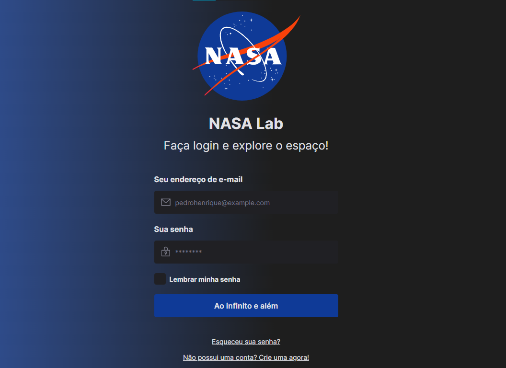

<h1 align="center">NASA Lab - Design System</h1>

  

<h2>👨‍🎨 Sobre</h2>

Projeto criado durante o Ignite Lab 03 oferecido pela Rocketseat. A aplicação é um Design System da NASA Lab, contendo o design e seus tokens no Figma, e os componentes e seus comportamentos (botões, inputs, textos, etc.) documentados no Storybook. Além disso, foi configurado um fluxo automatizado de deploy no próprio Github, para que quando haja uma alteração feita nos componentes, essa alteração seja aplicada automaticamente na página estática do Storybook que está publicada em: <a href="https://matheus-pazinati.github.io/lab-nasa-design-system/">Storybook</a> 

 
<h2>🎯 Objetivo</h2>

O projeto me mostrou um novo ponto de vista sobre a área de programação front-end, onde o profissional que antes lidava apenas com códigos, deve possuir uma visão holística do produto e de sua stack, possuindo conhecimentos em design, e trabalhando com ferramentas como o Storybook, que permitem documentar os componentes das aplicações, com o objetivo de aumentar a produtividade, e melhorar a manutenção das mesmas. Neste projeto, pela primeira vez, criei o meu próprio design utilizando a ferramenta Figma, e pude entender como um design estruturado de forma correta faz total diferença na criação da aplicação (performance, manutenção, etc.)

 
<h2>🛠️ Tecnologias e ferramentas/bibliotecas utilizadas</h2>
<ul>
  <li><a href="https://pt-br.reactjs.org/">ReactJS</a></li>
  <li><a href="https://www.typescriptlang.org/">Typescript</a></li>
  <li><a href="https://tailwindcss.com/">TailwindCSS</a></li>
  <li><a href="https://www.radix-ui.com/">Radix-UI</a></li>
  <li><a href="https://storybook.js.org/">Storybook</a></li>
</ul>
 
<h2>📌 Funcionalidades a serem implementadas</h2>
<ul>
  <li>Fazer variações dos componentes de input no momento do envio do formulário, para quando estes estiverem vazios ou preenchidos com dados incorretos.</li>
  <li>Simular e documentar no Storybook o formulário sendo preenchido e enviado para uma API fictícia.</li>
  <li>Criar testes, e executa-los dentro do Storybook.</li>
</ul>
 
<h2>🔖 Layout</h2>

Você pode visualizar o layout do projeto através deste link: <a href="https://www.figma.com/file/LKsdf8krrG3nwuX6XPi0LZ/Ignite-Lab---Design-System?node-id=0%3A1">Layout do projeto</a>. É necessário possuir uma conta no <a href="https://figma.com">Figma</a> para acessá-lo.

 
 

Made by Matheus Pazinati 🛸
